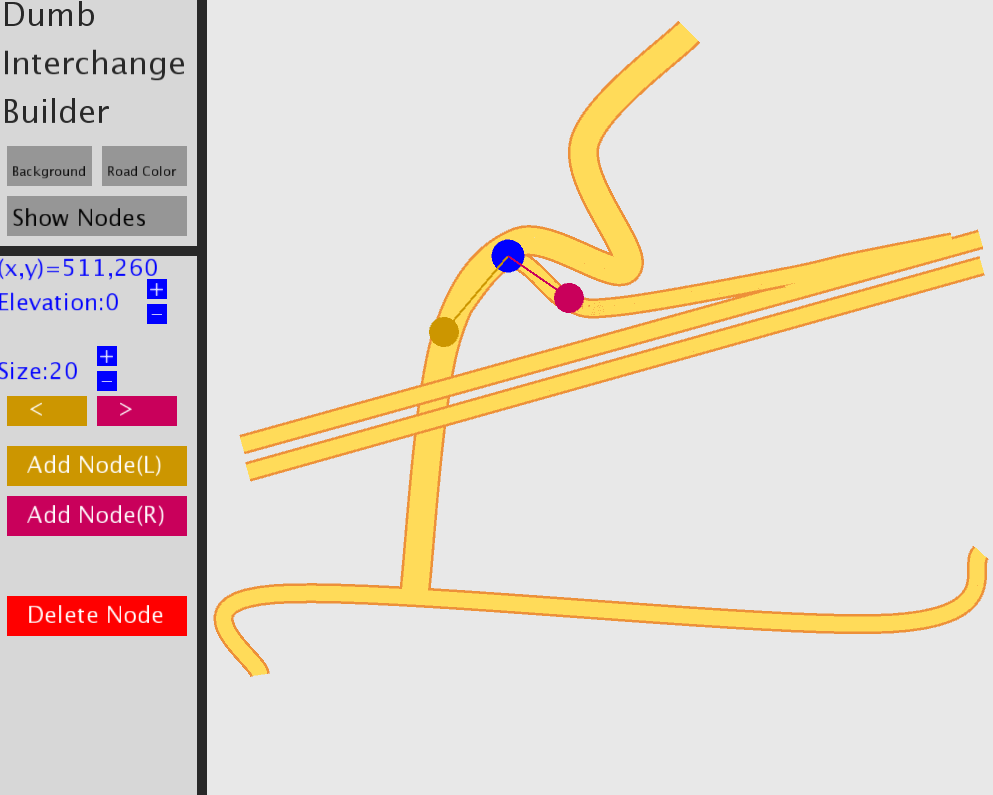

# Dumb Interchange Builder
Dumb Interchange Builder is a Processing sketch that provides a simple yet effective tool for quickly designing highway interchanges. 

## Installation
Feel free to [download](https://github.com/Codenameaidan/DumbInterchangeBuilder/releases/download/1.0/DumbInterchangeBuilder.zip) the .zip release, unzip, and run the executable file: interchange.exe.  However, since this is a .exe, Windows will attempt to block you from running it, though you can easily bypass this.  If you don't trust me (who could blame you?), you're also very welcome to download the source code and run interchange.pde in a Processing Environment yourself.

## Usage
Nothing too complicated here.  Change background/road colors at the top, and show and hide nodes.  Drag anywhere except the left menu to create highways.  Individual nodes can be clicked and dragged around to create curves.  Select a node, and you'll have the option to change its elevation and size, as well as to add a new node on the left or right (marked by colors) of it.  If nodes are on the same elevation, they will 'intersect' each other (see the bottom 'T' in the image), but if they are on different elevations, they will pass above/below each other.